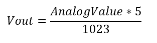

# **MQ135 Library**
## **Introduction**

MQ135 is a stable, low-electrochemical gas sensor that uses SnO2 as a sensitive material. When the pollution gas comes in contact, a chemical reaction takes place and the sensor's conductivity gets higher. This change in resistance is used to calculate the gas concentration. The MQ series of gas sensors use a small heater inside with an electrochemical sensor and are usually used indoors at room temperature. Their calibration preferably requires a known concentration of the measured gas. The datasheet claims that the MQ135 is suitable for CO2, Alcohol, Benzene, NOx, and NH3.

Note: **Before taking the reading from the sensor, a few predefined values like load resistance, atmospheric concentration and calibrated resistance values have to be found and written in the header file (MQ135.h).** The procedure to find those values have been listed below in the documentation. And the sensor must be preheated for some required time as mentioned in the datasheet.

## **Schematic of MQ135:**

    

To identify the concentration of impurities, we have to monitor the change in the resistance of the sensor. 

`getResistance()` function uses the below steps of formulas to know the resistance of the sensor:

RL is the load resistance and should be obtained from the resistance of the potentiometer on the sensor. (in the library it is set to max value i.e. 10 kOhm)

The reading we get from the pin connected to the sensor is the voltage across the RL.

To convert the analog value (0-1023) to the corresponding voltage value (Vout)(0-5V), we use the formula:

    

Resistance of the sensor (Rs) according to the schematic will be:

    

    

The `getResistance()` function returns this value of Rs.

So, now that we know the value of Rs, we use the readings obtained from the sensitivity curve of MQ-135 to obtain the concentration of the gas.

## **The typical sensitivity characteristics of the MQ-135:**

These readings are obtained under the following conditions:

- Temp: 20, Humidity: 65%, RL=10kΩ,
- Ro: resistance value obtained in clean atmosphere,
- Rs: sensor resistance at various concentrations of gases. 

The graph is a log-log graph and shows plots for multiple gases. The x-axis is the detected concentration of the gas in parts per million (PPM) while the y-axis is the RS/R0 ratio - the ratio of the sensor resistance in clean air over the resistance of the sensor in various gases.

The resistance ratio of the sensor (RS/RO) and the gas concentration (ppm) are related as a power function: y = a\*x^b, where a is the scaling factor and b is the exponential factor.

Using power regression analysis, we can obtain this scaling factor (a), and the exponential factor (b), for the gas. Then the formula to calculate the PPM concentration will be

    

The `getGasPPM()` function uses this formula and returns the PPM value.

The calibration of Rs can be done in clean air once stable readings are being received from the sensor using the formula

    

Here, PPM refers to the concentration of gas in clean atmosphere.

The `getGasRZero()` function uses this formula to return the GasRZERO value.

The RZERO value should be found using this function and the value has to be changed in the header file.

Since the sensitivity graph is plotted under standard conditions of temperature and humidity, we need to find the corrected resistance and concentration values for the atmospheric conditions in which the sensor is present while taking the reading. 

The correction factor used to get the corrected reading is given by

    

Where, CORA, CORB, CORC and CORD are predefined correction parameter values.

The function `getCorrectionFactor(t,h)` returns the correction factor using the above formula.

Then the corrected resistance and concentration values will be

    

These corrected values are returned by the `getCorrectedResistance(t,h)`, `getGasCorrectedRZero(t,h)` and `getGasCorrectedPPM(t,h)` functions. ‘t’ and ‘h’ will be the temperature and relative humidity values.

These temperature and humidity values have to be read by some other sensor like DHT11.

## **Procedure to calculate scaling (a) and exponential factors (b):**

First, we need to collect values from the sensitivity curve provided in the datasheet.

[*WebPlotDigitizer*](https://apps.automeris.io/wpd/) is the tool we are going to use here:

1) Load the image of the graph into the website. 
1) Choose plot type as 2D(X-Y) plot 
1) Then align the axis and then click complete
1) Select log scale for both the x and y axis as this is a log-log graph.
1) Then add atleast 10 points on the line of the particular gas whose factors are needed to be calculated. 
1) Go to ‘view data’.
1) Now you will get the coordinates of those points for a particular gas. 
1) Now use [this website](https://www.statology.org/power-regression-calculator/) to fit the data points into the power regression and generate the scaling and exponential factor.

These obtained values for each gas are used to calculate PPM concentrations.

The example Arduino codes to calculate RZERO and the PPM concentration and their corresponding outputs are also provided in the repository under Arduino Codes.
